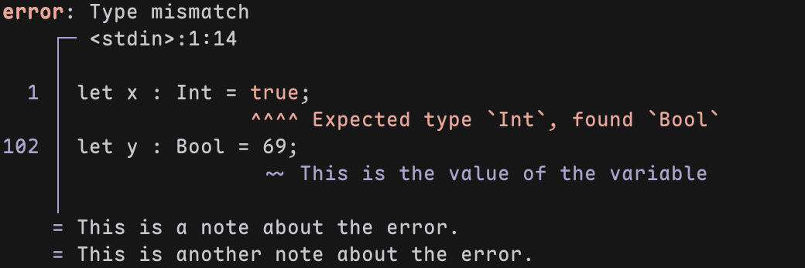

# zspan

Beautiful diagnostic formatting in Zig, _heavily_ inspired by [codespan](https://github.com/brendanzab/codespan).

## What it looks like
This is the current output of the `zspan` example program. All of this based only on byte offsets!

## What it do
**zspan** is a diagnostic reporter for Zig that:
- nicely alligns line numbers and code snippets
- aligns caret (`^`) and tilde (`~`) underlines under offending code
- lets you attach inline messages and notes
- is designed for compilers, linters, or any kind of code-aware tool

## Status
This project is WAY harder than i anticipated. it is currently in a very early stage, and the code is really, _really_ bad. I am working on it, but it will take some time to get it right.
I'm building this project mainly for myself and learning purposes so please don't scream at me for the bad code. This thing can do some basic stuff but i still need to add like multiline spans, proper file handling, proper rendering, handle uft-8 and so on.

## Todo
- [ ] create a file abstraction to handle multiple files (cache byte offsets, etc.)
- [ ] create a `Renderer` to separate the logic from diagnostics
