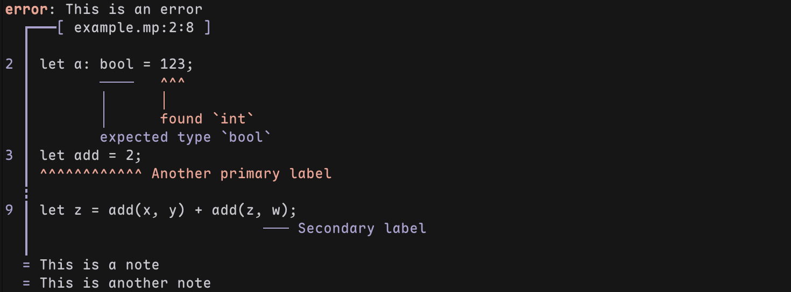

# zspan
Beautiful diagnostic formatting in zig, heavily inspired by [codespan](https://github.com/brendanzab/codespan).

## What it looks like
This is the current output of the `zspan` example program. All of this based only on byte offsets!

## What it do
**zspan** is a diagnostic reporter for Zig that:
- nicely alligns line numbers and code snippets
- full configurable character set (utf8) and color support
- aligns underlines under offending code
- lets you attach inline messages and notes
- supports multiple labels on the same line and aligns them properly, adding extra lines if necessary
- non-overlapping multiline labels are now supported
- is designed for compilers, linters, or any kind of code-aware tool
